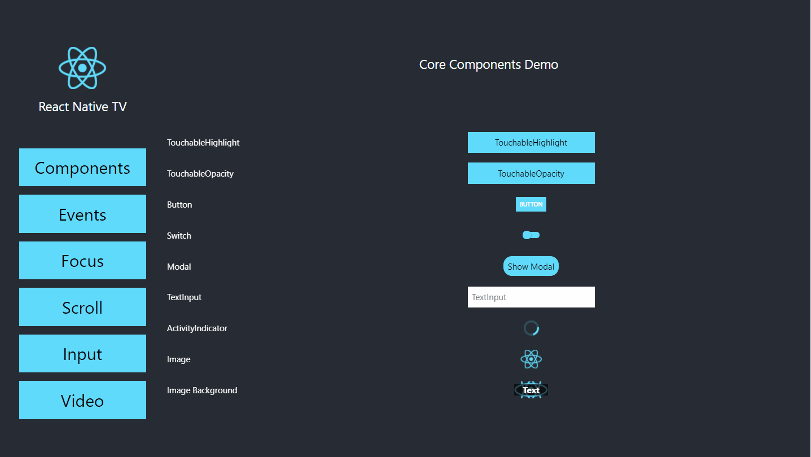
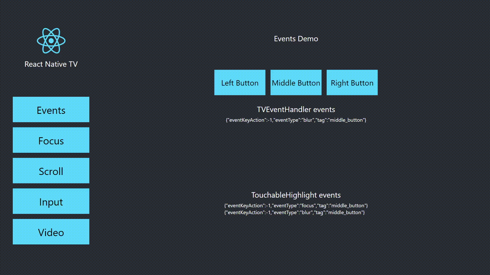
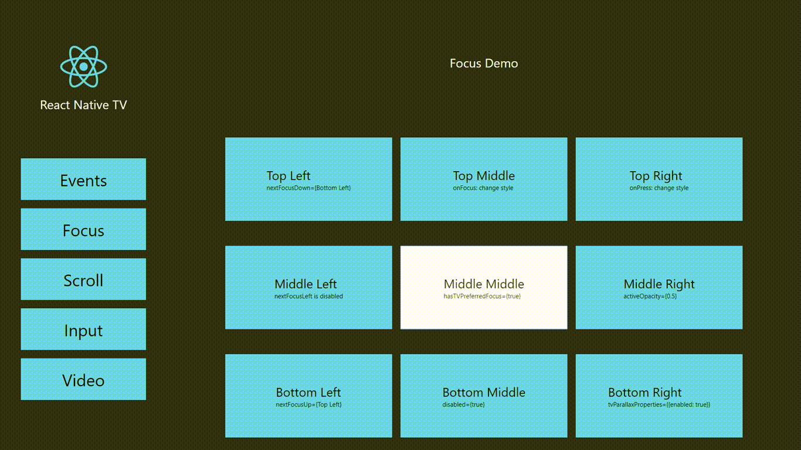
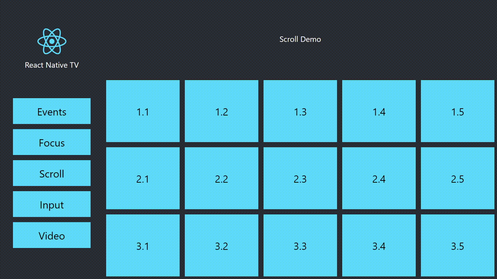
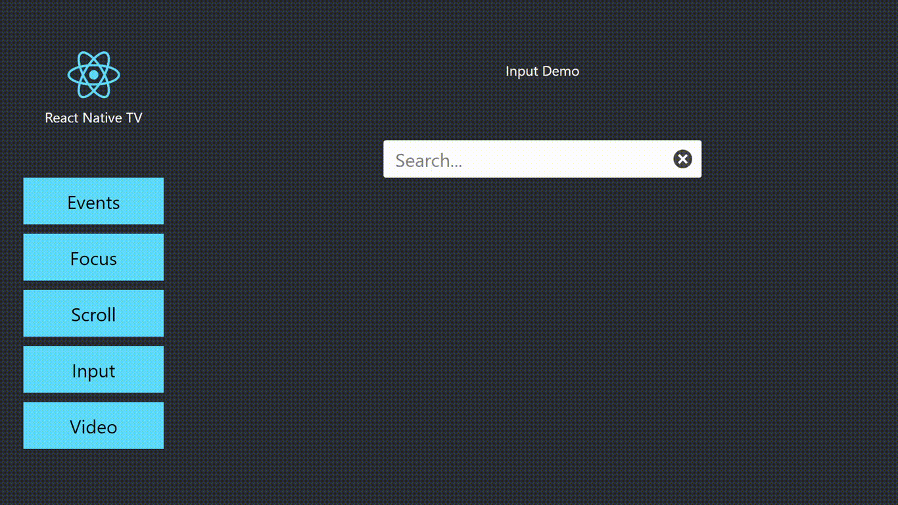

# react-native-tv-demo

Sample React Native project to test basic features on TV devices.

React Native has a documentation for building for TV Devices :<br />
https://reactnative.dev/docs/building-for-tv<br />
    
This sample project provides UI elements to test compatibility across targeted native devices and web.

Once the app is installed on the device, it is possible to test the following elements:

 - Components
 - Events
 - Focus
 - Scroll
 - Input
 - Video 
 
## Get started

Install :

```
git clone git@github.com:dev-seb/react-native-tv-demo.git
cd react-native-tv-demo/
yarn install
```

Test :

```
# AndroidTV
yarn run android

# tvOS
yarn run ios

# Browser
yarn run web
```
 
## Demos

### Components



 - TouchableHighlight
 - TouchabeOpacity
 - Button
 - Switch
 - TextInput
 - Modal
 - Activity Indicator
 - Image
 - ImageBackground
 
### Events



- BackHandler global events
- TVEventHandler global events 
- Touchable events : onPress, onFocus, and onBlur.

### Focus



- hasTVPreferredFocus
- disabled
- nextFocusDown
- nextFocusUp
- nextFocusLeft
- nextFocusRight
- nextFocusForward
- change style on select
- change style on press
- tvParallaxProperties

### Scroll



- ScrollView
- nested ScrollViews
- FlatList
- SectionList
- vertical scroll
- horizontal scroll
- align vertically selected item
- center horizontally selected item

### Input



- selectable input
- autocompletion search
- nested selectable elements

### Video


- play / pause
- duration
- fullscreen
- overlay with timer
- progressbar
- seek feature

## Web support

React Native allows us to compile for AndroidTV and tvOS, that's great!<br />
But some Set-Top-Box or TV devices requires HTML5, or hybrid WebApps.<br />

To have a more universal app with the same code base, we can export a React Native project to web by following this steps :

### Add react-native-web with TV support:

React Native Web project doesn't support most features for TV, we have to use this fork instead:<br />
https://github.com/dev-seb/react-native-web

Install and build from sources :

```
git clone git@github.com:dev-seb/react-native-web.git
cd react-native-web/
git checkout feature/tv-support
yarn install
yarn run compile
```

Return to project root directory and add dependency locally :

```
yarn add ./react-native-web/packages/react-native-web/
```

This fork requires the following env to be set in .env file :

```
REACT_APP_IS_TV=true
```

This will add support for Platform.isTV property.

### Add Web support for react navigation

Since v5.x, react navigation support Web Browsers. Just add the dependency : 

```
yarn add @react-navigation/web
``` 

### Add react-dom and react-scripts :

To bundle our code for web, we need react-dom and react-scripts : 

```
yarn add react-dom
yarn add react-scripts --save-dev
```

### Move web assets to "web" platform directory

Create a "web" directory at the root of the project to fit react-native distinct working directories per platform pattern.<br />
Inside this new directory, create "public" and "build" sub-directories, index.js and index.html files, following this tree structure :

```
web/
├── build/
├── public/
│   └── index.html
├── index.js
```

The web/index.js for web application is almost the same as for native apps, but it requires this code :

```javascript
AppRegistry.runApplication("MyTVApp", {
  rootTag: document.getElementById('main'),
});
```

### Add spatialNavigationPolyfill dependencies

AndroidTV and tvOS have build-in spatial navigation management.

On web we can rely on the spatialNavigationPolyfill library to get a similar behaviour:<br />
https://github.com/WICG/spatial-navigation/polyfill

Download the dependency at the root of the web directory and include it from the web/index.js file :

```
import './spatialNavigationPolyfill.js';
``` 

### Override react-scripts config

Install react-app-rewired in order to override react-scripts configuration :

```
yarn add react-app-rewired --save-dev
```

Add a "config-overrides.js" file at the root of the project :

```javascript
/**
 * react-app-rewirred overrides for react-scripts
 */
module.exports = {

  /**
   * Search for .web.js files
   */
  webpack: (config, env) => {
    config.resolve = {
      alias: {
        'react-native$': 'react-native-web',
      },
      extensions: [
        '.web.js',
        '.js',
      ],
    };
    return config;
  },

  /**
   * Changes some paths to web/ directory
   */
  paths: (paths, env) => {
    paths.appBuild = paths.appPath + '/web/build';
    paths.appPublic = paths.appPath + '/web/public';
    paths.appHtml = paths.appPath + '/web/public/index.html';
    paths.appIndexJs = paths.appPath + '/web/index.js';
    return paths;
  }

};
```

This will search for .web.js extension to include specific js files for web<br />
It also moves some files expected by react-scripts to the "web" directory.

### Change package.json file

Add alias in package.json file required by react-native-web :

```
"alias": {
  "react-native": "react-native-web"
}
```

We can now run and build for web platform using the react-scripts via react-app-rewired :

Start application to browser :

```
react-app-rewired start
```

Build application to web/build/:

```
react-app-rewired build
```

As we want to add the web as an other platform, we add this lines in the scripts section of our package.json :

```
"scripts": {
  "start": "react-native start",
  "android": "react-native run-android",
  "ios": "react-native run-ios",
  "web": "react-app-rewired start",
  "web:build": "react-app-rewired build"
},
```

Now we can use the yarn commands for web platform:

```
yarn run web
yarn run web:build
```

### Tips

#### Env

Don't forget the REACT_APP_IS_TV env variable to enable TV features with react-native-web fork.

#### Sources

Move project sources and especially App.js into src/ directory.

See related issue: https://github.com/necolas/react-native-web/issues/794

#### Node Handle

React Native Web returns a DOM object from findNodeHandle(ref.current), but native platforms return a number.

It is more suitable to use the nativeID attribute instead, for example to test event.eventTag from TVEventHandler callbacks or manage next focus from setNativeProps. 

#### Next Focus 

There are two ways to manage next focus:
* Using props as documented in React Native documentation.
* Using the setNativeProps method as next focus is supported in the react-native-web fork.

For props, using findNodeHandle will work on all platforms, though Web seems to require an intermediate state variable to work.

For setNativeProps, we need to have a method that returns handle for native platforms and nativeID for Web (see "Node Handle" explanation for this issue). 

#### Override navigation

To lock navigation in one direction, pass the element its own reference using a nextFocus props.<br />
Then is is possible to catch key events using the TVEventHandler checking the eventTag to perform custom action on this element.

#### Override back button

To lock back button default action, use the react-navigation "breforeRemove" event and call event.preventDefault() if needed. 

#### Text Input

On Android Simulator, use directional pad from extended controls instead of computer keyboard to test text input.<br />
To get the focus on AndroidTV, we use a dummy focusable component to trigger focus from ref during navigation.

#### Video 

For video we use the react-native-video, but this plugin doesn't provides support for react-native-web.<br />
We have to create the same APIs for web using the &lt;video&gt; element to get similar bahaviour.

See this file as example: https://github.com/dev-seb/react-native-tv-demo/blob/master/src/components/demos/Video.js

#### Modal

On Web, we have to override the back button to hide modal, on AndroidTV use onRequestClose() callback.

When testing on a browser, the Modal window will be centered inside the browser window.<br />
Resize your browser or use it on fullscreen mode with zoom to window boundaries to get the modal centered as expected.


